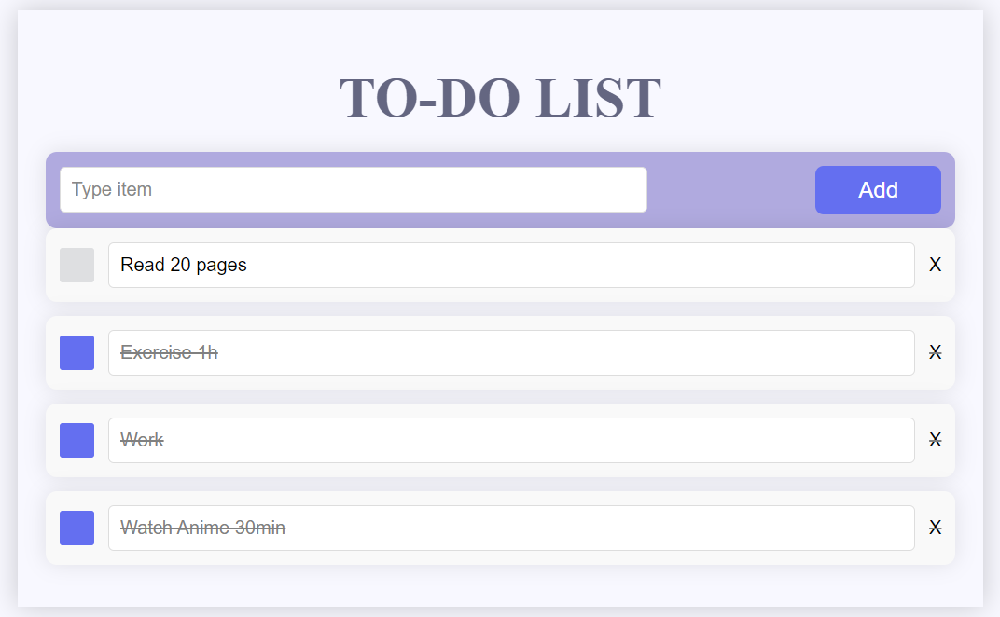

# To-Do List App

A basic to-do list application built with React.



## Features

- Add new to-do items
- Remove to-do items
- Edit to-do item names
- Check/uncheck to mark completion status

## Getting Started

1. Clone the repository:

   ```bash
   git clone <repository-url>
   ```

2. Navigate to the project directory:

   ```bash
   cd react-to-do-list-app
   ```

3. Install dependencies:

   ```bash
   npm install
   ```

4. Run the application:

   ```bash
   npm start
   ```

5. Open your browser and visit [http://localhost:3000](http://localhost:3000) to view the app.

## Usage

- Type a new to-do item in the input field and click the "Add" button.
- Click the checkbox next to an item to mark it as complete. The item will be strikethrough and greyed out.
- Edit an item by clicking on its name. Press Enter or click outside the input field to save changes.
- Remove an item by clicking the "X" button next to it.

## Technologies Used

- React
- Framer Motion (for animations)

## License

This project is licensed under the MIT License - see the [LICENSE](LICENSE) file for details.

---

Feel free to customize the content based on the specific details of your project. If you don't have a license file yet, you can create one or omit the "License" section.